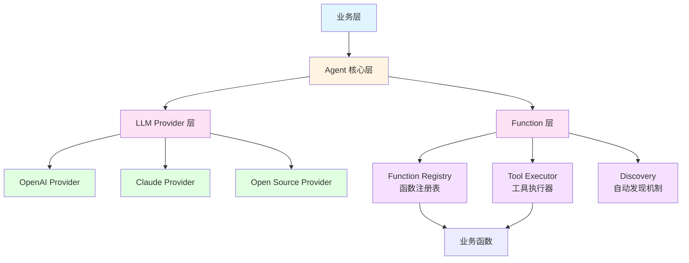

# Agent 技术架构与内容设计

## 一、技术架构

### 1.1 架构概览

本系统采用 **分层架构** 和 **策略模式**，提供统一的大语言模型（LLM）调用和函数调用（Function Calling）框架，支持多种 LLM 提供商和灵活的函数注册机制。



### 1.2 技术栈

- **核心框架**: Python 3.8+
- **异步支持**: asyncio
- **LLM 提供商**:
  - OpenAI（GPT 系列）
  - Anthropic（Claude 系列）
  - 开源模型（兼容 OpenAI API 格式）
- **设计模式**: 
  - 策略模式（Provider 切换）
  - 注册表模式（Function Registry）
  - 工厂模式（Provider 创建）

### 1.3 架构层次说明

#### Agent 核心层（agent.py）
- **职责**: 整合 LLM 提供商和函数调用机制，提供统一的对话接口
- **功能**:
  - 多轮对话管理
  - 函数调用迭代处理
  - 对话历史维护
  - 消息解析和结构化提取

#### LLM Provider 层（providers/）
- **职责**: 封装不同 LLM 提供商的 API 调用，提供统一接口
- **功能**:
  - 统一的聊天接口（`chat` 方法）
  - 函数调用支持检测
  - 消息格式转换
  - 响应结果标准化

#### Function 层（functions/）
- **职责**: 管理 Agent 可调用的函数，提供注册、发现和执行机制
- **功能**:
  - 函数注册和管理（Registry）
  - 函数执行（Executor）
  - 自动发现和注册（Discovery）

## 二、核心组件详解

### 2.1 Agent 核心类

**文件**: `agent/agent.py`

**主要功能**:
1. **对话管理**: 维护完整的对话历史，支持多轮对话
2. **函数调用迭代**: 自动处理 LLM 的函数调用请求，执行函数并将结果返回给 LLM，支持多轮迭代
3. **消息解析**: 从非结构化消息中提取结构化数据

**关键方法**:
- `chat()`: 与 Agent 进行对话，支持函数调用和多轮迭代
- `parse_message()`: 解析消息并提取结构化数据
- `register_function()`: 便捷方法，直接注册函数到注册表
- `clear_history()`: 清空对话历史

**工作流程**:
```
用户消息 → Agent.chat() → LLM Provider → LLM 响应
                                    ↓
                           是否包含函数调用？
                           /              \
                        是                否
                        ↓                  ↓
                执行函数调用          返回最终回复
                        ↓
                将结果返回给 LLM
                        ↓
                继续迭代（最多 max_iterations 次）
```

### 2.2 LLM Provider 层

**文件**: `agent/providers/`

#### 2.2.1 基础接口（base.py）

定义了所有 Provider 必须实现的抽象接口：

- **LLMProvider**: 抽象基类
  - `chat()`: 发送聊天请求并获取回复
  - `supports_function_calling()`: 是否支持函数调用
  - `model_name`: 模型名称属性

- **数据类**:
  - `LLMMessage`: 消息对象（role, content, name）
  - `FunctionCall`: 函数调用对象（name, arguments）
  - `LLMResponse`: LLM 响应对象（content, function_calls, finish_reason）

#### 2.2.2 具体实现

**OpenAI Provider** (`openai_provider.py`):
- 支持 OpenAI GPT 系列模型
- 支持自定义 base_url（兼容 OpenAI API 格式的第三方服务）
- 使用 OpenAI Python SDK

**Claude Provider** (`claude_provider.py`):
- 支持 Anthropic Claude 系列模型
- 使用 Anthropic Python SDK
- 支持工具使用（tool use）功能

**Open Source Provider** (`open_source_provider.py`):
- 支持兼容 OpenAI API 格式的开源模型
- 可配置 base_url、model、api_key
- 支持自定义超时设置

#### 2.2.3 Provider 工厂（__init__.py）

提供 `create_provider()` 工厂函数，根据类型字符串创建对应的 Provider 实例：

```python
provider = create_provider("openai", api_key="sk-...", model="gpt-4o-mini")
provider = create_provider("claude", api_key="sk-ant-...", model="claude-3")
provider = create_provider("open_source", base_url="http://localhost:8000/v1", model="qwen")
```

### 2.3 Function 层

**文件**: `agent/functions/`

#### 2.3.1 函数注册表（registry.py）

**FunctionRegistry 类**:
- **职责**: 管理所有可被 Agent 调用的函数
- **功能**:
  - 注册函数及其元数据（名称、描述、参数 Schema）
  - 根据函数签名自动推断参数类型
  - 提供函数列表供 LLM function calling 使用

**关键方法**:
- `register()`: 注册函数到注册表
- `list_functions()`: 列出所有已注册的函数（LLM function calling 格式）
- `get_function()`: 根据名称获取函数定义
- `has_function()`: 检查函数是否已注册

**自动类型推断**:
- 支持基本 Python 类型（str, int, float, bool, list, dict）
- 支持 Optional/Union 类型
- 生成符合 JSON Schema 规范的参数定义

#### 2.3.2 工具执行器（executor.py）

**ToolExecutor 类**:
- **职责**: 执行 Agent 通过 function calling 调用的函数
- **功能**:
  - 从注册表中查找函数
  - 执行函数调用（支持同步和异步函数）
  - 格式化函数执行结果为字符串

**关键方法**:
- `execute()`: 执行函数调用，自动处理同步/异步函数
- `format_result()`: 格式化函数执行结果为字符串（JSON 格式）

#### 2.3.3 自动发现机制（discovery.py）

提供多种方式自动发现和注册函数：

1. **装饰器方式** (`@agent_callable`):
   ```python
   @agent_callable(description="查询顾客信息")
   def get_customer(name: str) -> dict:
       ...
   ```

2. **实例方法注册** (`register_instance_methods`):
   ```python
   register_instance_methods(registry, db_repo, prefix="db_")
   ```

3. **模块函数注册** (`register_module_functions`):
   ```python
   register_module_functions(registry, repo_module, prefix="repo_")
   ```

4. **类方法注册** (`register_class_methods`):
   ```python
   register_class_methods(registry, DatabaseRepository, prefix="db_", instance=db_repo)
   ```

5. **自动发现** (`auto_discover_and_register`):
   ```python
   auto_discover_and_register(registry, [db_repo, membership_svc])
   ```

**特性**:
- 自动识别对象类型（模块、类、实例）
- 支持函数名前缀
- 支持过滤函数
- 优先使用装饰器配置

## 三、数据流设计

### 3.1 对话流程

```
1. 用户发送消息
   ↓
2. Agent.chat() 接收消息，添加到对话历史
   ↓
3. 准备函数定义列表（如果有注册函数）
   ↓
4. 调用 LLM Provider.chat()
   ↓
5. LLM 返回响应（可能包含函数调用）
   ↓
6. 判断是否有函数调用？
   ├─ 否 → 返回最终回复
   └─ 是 → 执行函数调用
       ↓
   7. ToolExecutor.execute() 执行函数
       ↓
   8. 格式化函数结果
       ↓
   9. 将结果添加到对话历史（role="function"）
       ↓
   10. 回到步骤 4，继续迭代
       （最多 max_iterations 次）
```

### 3.2 函数调用流程

```
1. LLM 决定调用函数
   ↓
2. LLM 返回 FunctionCall 对象列表
   ↓
3. Agent 遍历每个函数调用
   ↓
4. ToolExecutor.execute() 查找函数
   ├─ 从 FunctionRegistry 获取函数定义
   ├─ 使用参数调用函数
   └─ 处理同步/异步函数
   ↓
5. 格式化执行结果
   ↓
6. 添加到对话历史（role="function"）
   ↓
7. LLM 基于函数结果继续处理
```

### 3.3 函数注册流程

```
1. 开发者定义函数或方法
   ↓
2. 选择注册方式：
   ├─ 使用 @agent_callable 装饰器
   ├─ 调用 register_instance_methods()
   ├─ 调用 register_module_functions()
   ├─ 调用 register_class_methods()
   └─ 调用 auto_discover_and_register()
   ↓
3. 自动推断参数类型（如果未提供）
   ↓
4. 注册到 FunctionRegistry
   ↓
5. 函数可用于 LLM function calling
```

## 四、关键设计决策

### 4.1 为什么使用抽象基类？

- **统一接口**: 不同 LLM 提供商有不同的 API 格式，通过抽象基类统一接口
- **易于扩展**: 添加新的 LLM 提供商只需实现 LLMProvider 接口
- **类型安全**: 使用类型注解和抽象方法，提供更好的 IDE 支持和类型检查

### 4.2 为什么分离 Registry 和 Executor？

- **职责分离**: Registry 负责管理，Executor 负责执行
- **灵活性**: 可以独立扩展注册机制和执行逻辑
- **可测试性**: 可以单独测试注册和执行功能

### 4.3 为什么支持自动发现？

- **开发效率**: 减少手动注册的代码量
- **维护性**: 新增函数自动可用，无需修改注册代码
- **灵活性**: 支持多种注册方式，适应不同场景

### 4.4 为什么支持多轮迭代？

- **复杂任务**: 某些任务需要多次函数调用才能完成
- **上下文理解**: LLM 可以基于前一次函数调用的结果决定下一步操作
- **灵活性**: 支持链式函数调用，实现复杂业务逻辑

## 五、使用示例

### 5.1 基础使用

```python
from agent import Agent, create_provider, FunctionRegistry

# 创建 LLM 提供商
provider = create_provider("openai", api_key="sk-...", model="gpt-4o-mini")

# 创建函数注册表
registry = FunctionRegistry()

# 创建 Agent
agent = Agent(provider, registry, system_prompt="你是一个有用的助手")

# 与 Agent 对话
response = await agent.chat("查询用户信息")
print(response["content"])
```

### 5.2 注册函数

```python
# 方式 1: 使用装饰器
@agent_callable(description="查询顾客信息")
def get_customer(name: str) -> dict:
    return {"name": name, "id": 123}

# 方式 2: 手动注册
registry.register(
    name="get_customer",
    description="查询顾客信息",
    func=get_customer
)

# 方式 3: 自动注册实例方法
from db.repository import DatabaseRepository
db_repo = DatabaseRepository()
register_instance_methods(registry, db_repo, prefix="db_")
```

### 5.3 多轮对话和函数调用

```python
# Agent 会自动处理函数调用
response = await agent.chat("查询张三的会员信息，然后计算他的积分")

# Agent 会：
# 1. 调用 db_get_customer(name="张三")
# 2. 基于结果调用 membership_get_points(customer_id=...)
# 3. 返回最终回复
```

### 5.4 切换 LLM 提供商

```python
# 使用 OpenAI
provider = create_provider("openai", api_key="sk-...", model="gpt-4o-mini")

# 切换到 Claude
provider = create_provider("claude", api_key="sk-ant-...", model="claude-3")

# 切换到开源模型
provider = create_provider(
    "open_source",
    base_url="http://localhost:8000/v1",
    model="qwen"
)

# Agent 无需修改，直接使用新的 provider
agent = Agent(provider, registry)
```

## 六、扩展指南

### 6.1 添加新的 LLM Provider

1. 在 `agent/providers/` 目录创建新文件
2. 继承 `LLMProvider` 抽象基类
3. 实现 `chat()`、`supports_function_calling()` 和 `model_name` 属性
4. 在 `__init__.py` 的 `create_provider()` 函数中添加新类型

### 6.2 自定义函数注册策略

1. 实现自定义的注册函数（参考 `discovery.py`）
2. 或扩展 `FunctionRegistry` 类添加新的注册方法
3. 使用 `naming_strategy` 参数自定义函数命名

### 6.3 扩展函数执行逻辑

1. 继承 `ToolExecutor` 类
2. 重写 `execute()` 或 `format_result()` 方法
3. 在创建 Agent 时使用自定义的 Executor

## 七、注意事项

### 7.1 函数调用限制

- 最大迭代次数：默认 10 次，可通过 `max_iterations` 参数调整
- 函数执行错误：会被捕获并作为 function 消息添加到对话历史
- 函数不存在：会抛出 ValueError 异常

### 7.2 类型推断限制

- 只支持基本 Python 类型，复杂类型可能被推断为 "string"
- 建议手动提供 `parameters` 参数以获得更精确的类型定义
- Optional[T] 类型会被正确处理

### 7.3 异步支持

- Agent 的所有方法都是异步的，需要使用 `await` 调用
- 函数可以是同步或异步的，执行器会自动处理
- LLM Provider 的 `chat()` 方法必须是异步的

### 7.4 对话历史管理

- 对话历史会一直累积，直到调用 `clear_history()`
- 系统提示词会在清空历史后自动恢复
- 大量对话历史可能影响 LLM 的响应速度和成本

## 八、总结

Agent 模块提供了一个完整、灵活、可扩展的大语言模型调用和函数调用框架。通过分层架构和策略模式，实现了：

1. **统一接口**: 不同 LLM 提供商可以无缝切换
2. **灵活注册**: 支持多种函数注册方式，适应不同开发场景
3. **自动迭代**: 支持多轮函数调用，处理复杂业务逻辑
4. **易于扩展**: 清晰的抽象和接口设计，便于添加新功能

该架构设计既保证了系统的灵活性和可扩展性，又提供了良好的开发体验和使用便利性。

