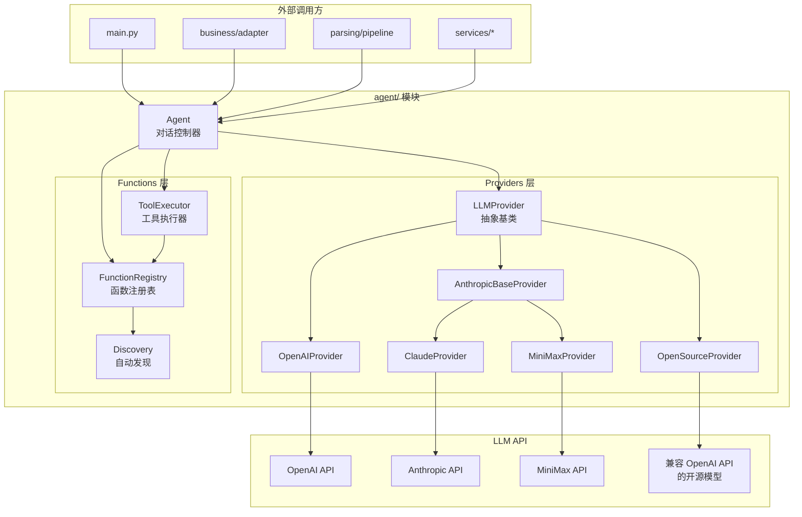
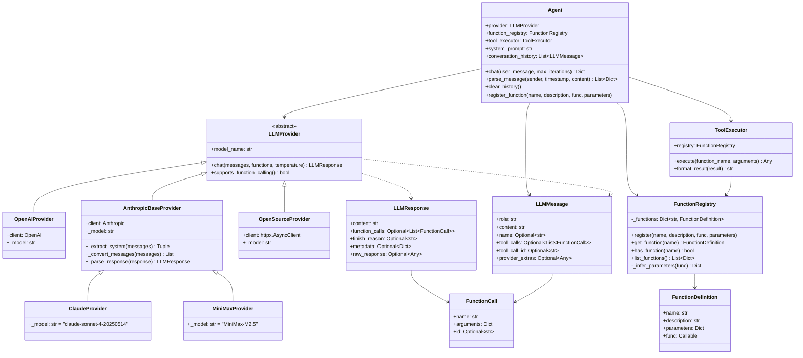
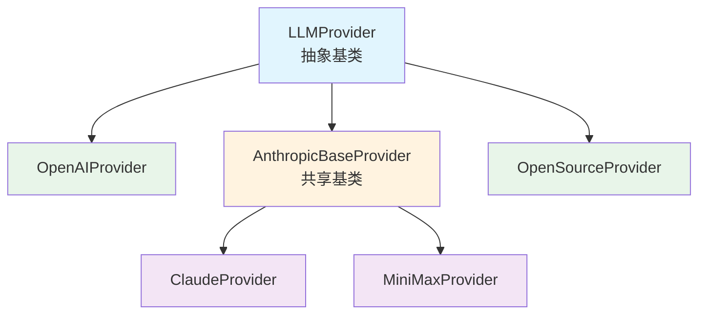
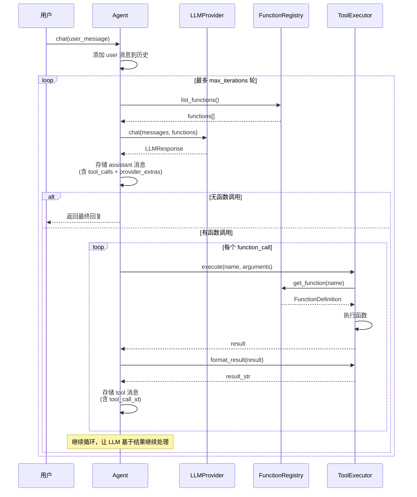
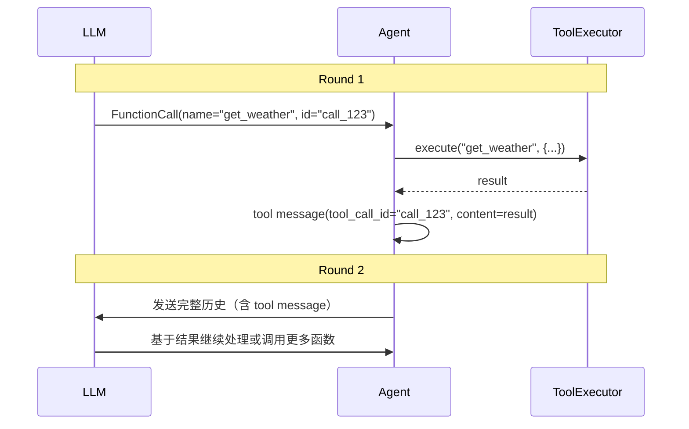
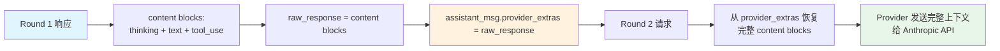
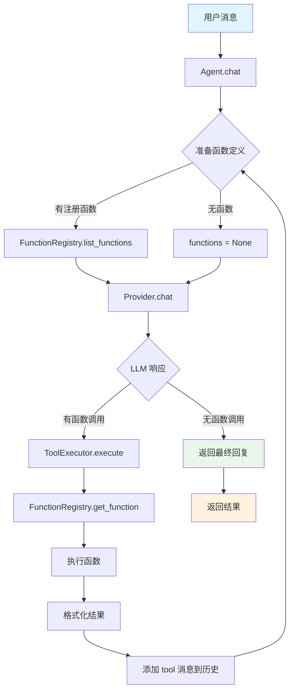
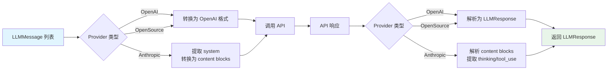

# Agent 模块设计文档

## 1. 模块概述

`agent/` 是一个**独立的大语言模型（LLM）调用与函数调用（Function Calling）框架**，采用 **策略模式 + 注册表模式 + 工厂模式**，支持多种 LLM 提供商的无缝切换和统一的函数调用机制。

### 设计目标

- **多模型透明切换**：通过策略模式支持 OpenAI、Claude、MiniMax 等多种 LLM 提供商，上层代码无需关心底层实现
- **函数调用统一管理**：通过注册表模式管理所有可调用函数，支持自动发现和手动注册
- **多轮对话支持**：正确处理多轮工具调用，通过 `tool_call_id` 和 `provider_extras` 机制保持上下文完整性
- **模块独立性**：`agent/` 可单独使用，不依赖 `database/`、`business/` 等模块

---

## 2. 架构分层



---

## 3. 模块文件结构

```
agent/
├── __init__.py              # 模块入口，统一导出
├── agent.py                 # Agent 核心类
├── providers/               # LLM 提供商层
│   ├── __init__.py          # 工厂函数 create_provider()
│   ├── base.py              # LLMProvider 抽象基类、数据类
│   ├── openai_provider.py   # OpenAI GPT 系列
│   ├── anthropic_base.py    # Anthropic SDK 共享基类
│   ├── claude_provider.py   # Claude 系列
│   ├── minimax_provider.py  # MiniMax 系列
│   └── open_source_provider.py  # OpenAI API 兼容的开源模型
└── functions/               # 函数调用层
    ├── __init__.py
    ├── registry.py          # FunctionRegistry 函数注册表
    ├── executor.py          # ToolExecutor 工具执行器
    └── discovery.py         # 自动发现和注册机制
```

---

## 4. 类关系图



---

## 5. 核心数据类

### 5.1 FunctionCall

```python
@dataclass
class FunctionCall:
    name: str                      # 函数名称
    arguments: Dict[str, Any]      # 调用参数
    id: Optional[str] = None       # 调用标识符 (tool_call_id / tool_use_id)
```

**说明**：`id` 用于在多轮工具调用中关联"调用请求"与"执行结果"。OpenAI 格式为 `call_xxx`，Anthropic 格式为 `toolu_xxx`。

### 5.2 LLMMessage

```python
@dataclass
class LLMMessage:
    role: str                                  # system / user / assistant / tool
    content: str                               # 文本内容
    name: Optional[str] = None                 # 函数名 (tool 消息)
    tool_calls: Optional[List[FunctionCall]]   # 触发的工具调用 (assistant 消息)
    tool_call_id: Optional[str] = None         # 关联的调用 ID (tool 消息)
    provider_extras: Optional[Any] = None      # 提供商原始数据 (透传)
```

**关键字段说明**：

- **tool_calls**：当 assistant 消息触发了工具调用时，记录所有 `FunctionCall` 对象。各 Provider 在下一轮请求时会从此字段重建 API 所需的格式。
- **tool_call_id**：tool 消息通过此字段引用对应的调用请求，确保 Provider 能正确匹配调用与结果。
- **provider_extras**：保存提供商原始响应数据（如 Anthropic 的 content blocks，包含 thinking、tool_use 等块）。Agent 将 `LLMResponse.raw_response` 存入此字段，下一轮请求时 Provider 从中恢复完整上下文，**无需任何缓存或状态管理**。

### 5.3 LLMResponse

```python
@dataclass
class LLMResponse:
    content: str                               # 文本回复
    function_calls: Optional[List[FunctionCall]] # 函数调用列表
    finish_reason: Optional[str] = None        # 完成原因
    metadata: Optional[Dict[str, Any]] = None  # 元数据 (thinking, usage 等)
    raw_response: Optional[Any] = None         # 原始响应 → provider_extras
```

---

## 6. Provider 层设计

### 6.1 继承体系



### 6.2 抽象接口

所有 Provider 必须实现以下三个方法：

```python
class LLMProvider(ABC):
    @abstractmethod
    async def chat(
        self,
        messages: List[LLMMessage],
        functions: Optional[List[Dict[str, Any]]] = None,
        temperature: float = 0.1,
        **kwargs: Any
    ) -> LLMResponse: ...
    
    @abstractmethod
    def supports_function_calling(self) -> bool: ...
    
    @property
    @abstractmethod
    def model_name(self) -> str: ...
```

**职责**：
1. 将 `LLMMessage` 列表转换为 API 所需格式
2. 调用 LLM API
3. 将响应转换为统一的 `LLMResponse`

### 6.3 OpenAIProvider

- **SDK**：`openai` Python SDK（同步 `client.chat.completions.create`）
- **消息转换**：
  - `assistant + tool_calls` → 重建 OpenAI `tool_calls` 结构（含 `id`, `type`, `function`）
  - `tool / function` → `role="tool"` + `tool_call_id`
- **函数定义**：转为 `tools` 格式 `[{"type": "function", "function": {...}}]`
- **支持 base_url**：可接入兼容 OpenAI API 的第三方服务

### 6.4 AnthropicBaseProvider（共享基类）

为 Claude 和 MiniMax 提供统一的消息转换与响应解析：

- **System 消息**：Anthropic 要求单独传递，基类自动提取
- **消息转换**：
  - `assistant + provider_extras` → 使用原始 content blocks（保留 thinking / tool_use）
  - `assistant` 无 extras → 纯文本 content
  - `tool / function` → `tool_result` 格式，打包到 `user` role
- **函数定义**：使用 `input_schema` 替代 `parameters`
- **响应解析**：
  - `text` 块 → `content`
  - `thinking` 块 → `metadata["thinking"]`（Interleaved Thinking）
  - `tool_use` 块 → `FunctionCall`（保留 `id`）
  - 原始 content blocks → `raw_response`（供下轮透传）
- **Token 使用**：自动解析 `usage` 信息（含缓存统计）

### 6.5 ClaudeProvider

继承 `AnthropicBaseProvider`，仅设置默认参数：
- 默认模型：`claude-sonnet-4-20250514`
- 默认 max_tokens：`2048`
- 默认 base_url：Anthropic 官方

### 6.6 MiniMaxProvider

继承 `AnthropicBaseProvider`，通过 Anthropic 兼容接口调用 MiniMax 模型：
- 默认模型：`MiniMax-M2.5`
- 默认 max_tokens：`4096`
- 默认 base_url：`https://api.minimaxi.com/anthropic`（国内）
- 国际 base_url：`https://api.minimax.io/anthropic`
- 支持 Interleaved Thinking（交错思维链）
- 支持 Prompt 缓存

**支持的模型**：MiniMax-M2.5, MiniMax-M2.5-highspeed, MiniMax-M2.1, MiniMax-M2.1-highspeed, MiniMax-M2

### 6.7 OpenSourceProvider

- **HTTP 客户端**：`httpx.AsyncClient`
- **消息转换**：与 OpenAIProvider 一致
- **支持配置**：`base_url`, `model`, `api_key`, `timeout`
- **适用部署**：vLLM, Ollama, LocalAI 等兼容 OpenAI API 的服务

### 6.8 工厂函数

```python
provider = create_provider("openai", api_key="sk-...", model="gpt-4o-mini")
provider = create_provider("claude", api_key="sk-ant-...")
provider = create_provider("minimax", api_key="sk-api-...", model="MiniMax-M2.5")
provider = create_provider("open_source", base_url="http://localhost:8000/v1", model="qwen")
```

---

## 7. Functions 层设计

### 7.1 FunctionRegistry（注册表）

管理所有可被 Agent 调用的函数。每个函数注册为 `FunctionDefinition`：

```python
@dataclass
class FunctionDefinition:
    name: str                    # 唯一标识名
    description: str             # LLM 可读描述
    parameters: Dict[str, Any]   # JSON Schema 格式参数定义
    func: Callable               # 实际函数对象
```

**核心方法**：
- `register(name, description, func, parameters=None)` — 注册函数（parameters 为 None 时自动推断）
- `get_function(name)` → `Optional[FunctionDefinition]`
- `has_function(name)` → `bool`
- `list_functions()` → `List[Dict]`（LLM function calling 格式）

**自动类型推断**：分析函数签名的类型注解，生成 JSON Schema：
- `str` → `"string"`, `int` → `"integer"`, `float` → `"number"`, `bool` → `"boolean"`, `list` → `"array"`, `dict` → `"object"`
- 支持 `Optional[T]` / `Union[T, None]`
- 有默认值的参数不加入 `required`

### 7.2 ToolExecutor（执行器）

```python
class ToolExecutor:
    async def execute(self, function_name, arguments) -> Any
    def format_result(self, result) -> str
```

- 从注册表查找函数并执行（自动处理同步/异步）
- 格式化结果：`None` → `"执行成功"`，`dict/list` → JSON 字符串，其他 → `str()`

### 7.3 Discovery（自动发现）

提供多种自动注册方式：

| 方式 | 函数 | 说明 |
|------|------|------|
| 装饰器 | `@agent_callable(name, description, parameters)` | 标记函数为可调用 |
| 实例方法 | `register_instance_methods(registry, instance, prefix)` | 注册对象所有公共方法 |
| 模块函数 | `register_module_functions(registry, module, prefix, filter_func)` | 注册模块所有公共函数 |
| 类方法 | `register_class_methods(registry, cls, prefix, instance)` | 注册类所有公共方法 |
| 自动发现 | `auto_discover_and_register(registry, targets)` | 自动识别类型并注册 |

**注册规则**：
- 跳过以 `_` 开头的私有方法/函数
- 跳过 `__xxx__` 特殊方法
- 跳过 `get_session`, `create_tables` 等内部方法
- 已用 `@agent_callable` 标记的优先使用装饰器配置

---

## 8. Agent 核心类

### 8.1 初始化

```python
agent = Agent(
    provider: LLMProvider,                    # 必需：LLM 提供商
    function_registry: Optional[FunctionRegistry],  # 可选：函数注册表
    system_prompt: Optional[str],             # 可选：系统提示词
)
```

初始化时自动创建 `ToolExecutor`，如有 `system_prompt` 则添加到 `conversation_history`。

### 8.2 对话流程 (chat)



**返回值**：
```python
{
    "content": str,                    # 最终回复
    "function_calls": List[Dict],      # 所有函数调用记录
    "iterations": int                  # 实际迭代次数
}
```

### 8.3 消息解析 (parse_message)

```python
records = await agent.parse_message(sender, timestamp, content)
```

从非结构化消息提取结构化数据（JSON 数组）。自动处理 Markdown code block 包裹。

### 8.4 辅助方法

- `clear_history()` — 清空对话历史，保留系统提示词
- `register_function(name, description, func, parameters)` — 便捷注册函数

---

## 9. 多轮工具调用的关键设计

### 9.1 tool_call_id 跟踪

多轮工具调用的正确性依赖于 ID 的精确跟踪：



**OpenAI 格式**：assistant 消息的 `tool_calls[].id` 与 tool 消息的 `tool_call_id` 匹配。
**Anthropic 格式**：`tool_use` 块的 `id` 与 `tool_result` 的 `tool_use_id` 匹配。

### 9.2 provider_extras 透传机制

Anthropic 系列 Provider 的多轮工具调用需要保持完整的 content blocks 上下文：



这种设计避免了在 Provider 层维护复杂的缓存/队列状态。

---

## 10. 数据流

### 10.1 完整对话流程



### 10.2 消息格式转换流程



---

## 11. 使用示例

### 11.1 基础对话

```python
from agent import Agent, create_provider

provider = create_provider("minimax", api_key="sk-api-...", model="MiniMax-M2.5")
agent = Agent(provider, system_prompt="你是一个友好的助手")

response = await agent.chat("你好")
print(response["content"])
```

### 11.2 带函数调用

```python
from agent import Agent, create_provider, FunctionRegistry

provider = create_provider("minimax", api_key="sk-api-...")
registry = FunctionRegistry()

def get_weather(city: str) -> dict:
    return {"city": city, "temperature": 22, "condition": "晴天"}

registry.register("get_weather", "获取城市天气信息", get_weather)

agent = Agent(provider, function_registry=registry, system_prompt="你是天气助手")
response = await agent.chat("北京今天天气怎么样？")
# Agent 自动调用 get_weather("北京") 并基于结果回复
```

### 11.3 自动注册数据库方法

```python
from agent.functions.discovery import register_instance_methods

db = DatabaseManager("sqlite:///data/store.db")
register_instance_methods(registry, db, prefix="db_")
# 自动注册: db_get_daily_records, db_get_customer_info, db_save_service_record 等
```

### 11.4 使用装饰器标记函数

```python
from agent.functions.discovery import agent_callable

@agent_callable(description="查询顾客信息")
def get_customer(name: str) -> dict:
    """根据名称查询顾客信息。"""
    # ...
    return customer_data

# 自动注册
auto_discover_and_register(registry, [get_customer])
```

### 11.5 切换 Provider

```python
# 只需更换 Provider，Agent 代码无需修改
provider = create_provider("openai", api_key="sk-...", model="gpt-4o-mini")
provider = create_provider("claude", api_key="sk-ant-...")
provider = create_provider("minimax", api_key="sk-api-...")
provider = create_provider("open_source", base_url="http://localhost:8000/v1", model="qwen")
```

---

## 12. 扩展指南

### 12.1 添加新 Provider

1. 在 `agent/providers/` 创建新文件
2. 继承 `LLMProvider`（或 `AnthropicBaseProvider`）
3. 实现 `chat()`, `supports_function_calling()`, `model_name`
4. 在 `providers/__init__.py` 的 `create_provider()` 中注册

**示例**：
```python
class MyProvider(LLMProvider):
    def __init__(self, api_key: str, model: str = "my-model"):
        self._api_key = api_key
        self._model = model
    
    @property
    def model_name(self) -> str:
        return self._model
    
    def supports_function_calling(self) -> bool:
        return True
    
    async def chat(self, messages, functions=None, **kwargs):
        # 1. 转换消息格式
        # 2. 调用 API
        # 3. 解析响应为 LLMResponse
        pass
```

### 12.2 自定义函数注册

```python
# 使用装饰器
@agent_callable(description="查询顾客信息")
def get_customer(name: str) -> dict: ...

# 批量自动注册
auto_discover_and_register(registry, [
    (db_manager, "db_"),
    (membership_service, "member_"),
])
```

---

## 13. 设计决策记录

### Q1: 为什么使用策略模式而非直接调用不同 SDK？

**决策**：通过 `LLMProvider` 抽象接口统一所有 LLM 调用。

**理由**：
- 上层代码（Agent）无需关心底层使用的是哪个 SDK
- 切换模型只需更换 Provider，无需修改业务代码
- 新模型接入只需实现接口，不影响现有代码

### Q2: 为什么 `provider_extras` 机制是必要的？

**决策**：通过 `provider_extras` 字段透传提供商原始数据，而非在 Provider 层维护状态。

**理由**：
- Anthropic 系列需要保持完整的 content blocks（thinking、tool_use 等）
- Agent 层统一管理对话历史，Provider 层保持无状态
- 避免在 Provider 层维护复杂的缓存/队列，降低复杂度

### Q3: 为什么 FunctionRegistry 支持自动类型推断？

**决策**：`register()` 方法在 `parameters=None` 时自动从函数签名推断参数类型。

**理由**：
- 简化函数注册流程，无需手动编写 JSON Schema
- 支持基本类型（str、int、float、bool、list、dict）和 Optional
- 复杂场景仍可手动提供 `parameters`，保持灵活性

### Q4: 为什么 ToolExecutor 自动处理同步/异步函数？

**决策**：`execute()` 方法自动检测函数是否为协程，统一处理同步和异步函数。

**理由**：
- 简化函数注册，无需区分同步/异步
- 支持混合使用同步和异步函数
- 自动等待异步函数完成，对调用方透明

---

## 14. 技术栈

| 分类 | 技术 |
|------|------|
| 语言 | Python 3.8+, asyncio |
| LLM SDK | `openai` (OpenAI / OpenSource), `anthropic` (Claude / MiniMax) |
| HTTP | `httpx` (OpenSourceProvider) |
| 日志 | `loguru` |
| 设计模式 | 策略模式、注册表模式、工厂模式、门面模式 |

---

## 15. 注意事项

1. **异步调用**：Agent 所有方法都是异步的，需用 `await` 调用
2. **迭代限制**：默认最大 10 轮迭代，可通过 `max_iterations` 调整
3. **错误处理**：函数执行错误会被捕获并以 tool 消息形式返回给 LLM
4. **历史管理**：对话历史持续累积，需适时调用 `clear_history()`
5. **类型推断**：自动推断仅支持基本类型，复杂场景建议手动提供 `parameters`
6. **Provider 透明**：上层代码无需关心使用哪个 Provider，切换只需改 `create_provider()` 参数
